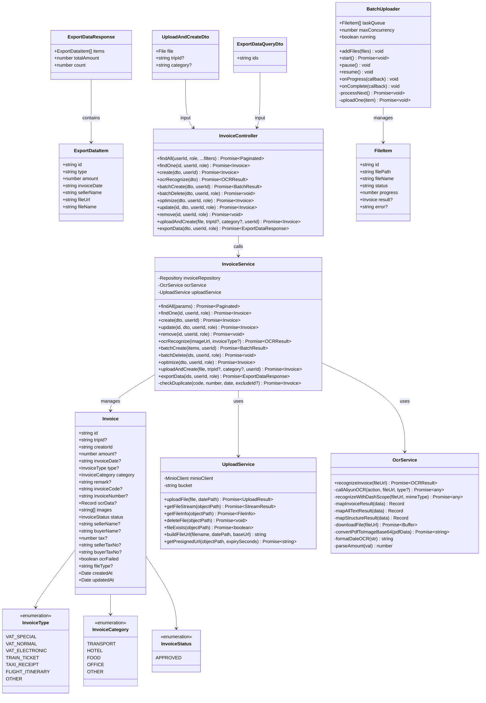
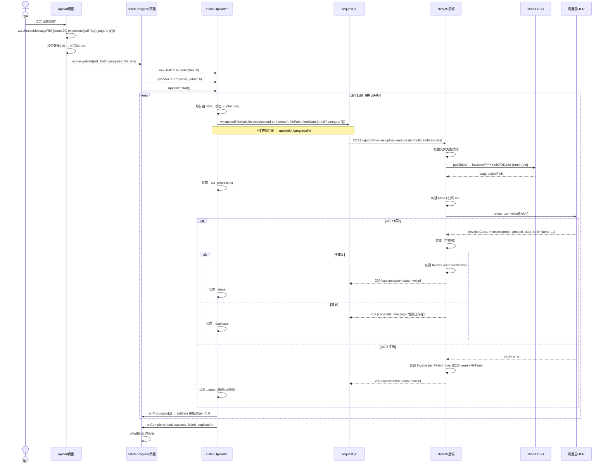
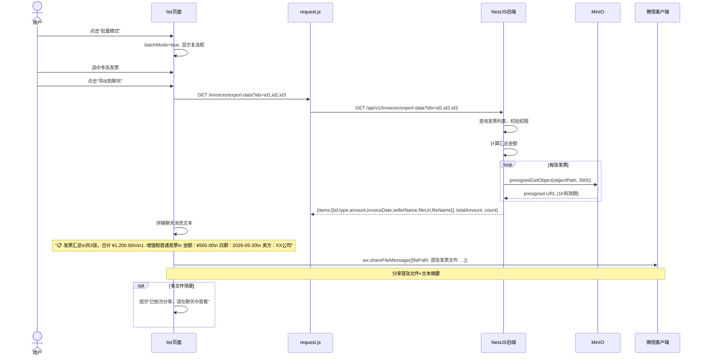
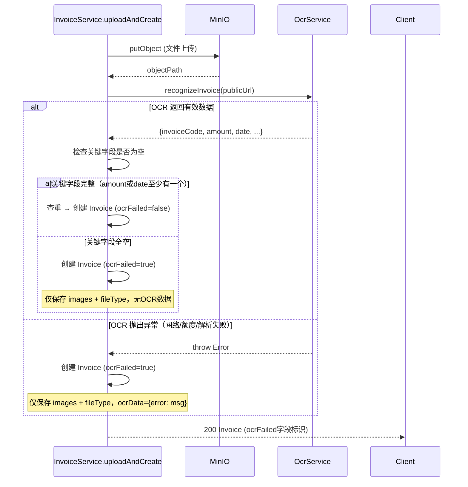
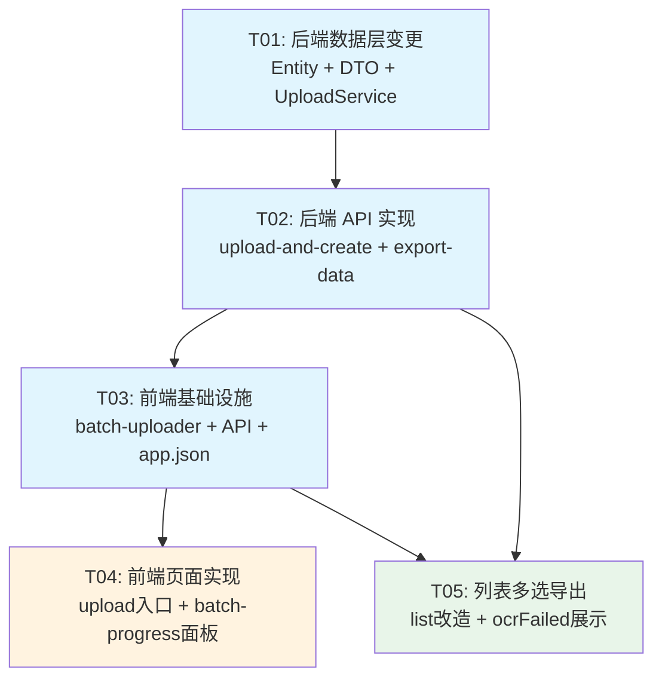

# 发票上传改版 — 系统设计文档

> 版本：v1.0 | 作者：Bob（架构师） | 日期：2026-05-28

---

## Part A: 系统设计

### 1. 实现方案

#### 1.1 核心难点分析

| 难点 | 说明 |
|------|------|
| **批量上传进度管理** | 微信小程序 `wx.uploadFile` 不支持单请求多文件，需前端维护任务队列逐个上传，实时展示每项状态 |
| **OCR 失败降级** | OCR 可能因图片质量、格式问题失败，需优雅降级：标记 `ocrFailed`，仍创建发票记录，列表展示"待补充"标签 |
| **图片格式扩展** | 原来仅支持 PDF，现需支持 JPG/PNG。阿里云 OCR 和 DashScope 均原生支持图片，MinIO 存储也无需变更 |
| **导出文件获取** | 微信 `shareFileMessage` 需要可下载的文件 URL，MinIO 私有 Bucket 需通过 presigned URL 提供临时访问 |
| **重复检测** | 保留现有三要素（发票代码+号码+日期）去重逻辑，批量场景下返回 `duplicate` 状态标记 |

#### 1.2 待确认问题决策

| 问题 | 决策 | 理由 |
|------|------|------|
| **Q1: 一体化接口 vs 前端串联** | ✅ **一体化接口** `POST /invoices/upload-and-create` | 批量场景下前端串联3个接口会极大增加复杂度；后端一体化可原子化处理，统一错误降级 |
| **Q2: 后端批量 vs 前端逐个调** | ✅ **前端逐个调一体化接口** | `wx.uploadFile` API 限制每次只能上传一个文件；前端维护任务队列，后端无需感知批次 |
| **Q3: 导出文件URL方式** | ✅ **MinIO presigned URL（1小时有效期）** | 微信分享需要公网可访问的临时URL；presigned URL 安全可控，不暴露存储路径 |
| **Q4: 单次数量上限** | ✅ **20个** | 与PRD建议一致；20个文件逐张OCR+上传约需60-120秒，用户体验可接受 |
| **Q5: 导出消息含行程上下文** | ✅ **不含行程上下文** | PRD明确格式：汇总行 + 每张摘要（类型/金额/日期/卖方）+ 原始文件，保持简洁 |

#### 1.3 框架选型

| 层 | 技术 | 说明 |
|----|------|------|
| **前端** | 微信原生小程序 | 沿用现有技术栈，不做框架切换 |
| **后端** | NestJS + TypeORM + PostgreSQL | 沿用现有技术栈 |
| **文件存储** | MinIO (自建 1.12.249.189:9000) | 新增 `presignedGetObject` 支持导出下载 |
| **OCR** | 阿里云 OCR（主）→ DashScope（备用） | 沿用现有 OCR 调用链，扩展图片格式支持 |
| **API 风格** | RESTful，multipart/form-data 上传 | 一体化接口使用 multipart 接收文件 |

#### 1.4 架构模式

```
┌─────────────────────────────────────────────────────┐
│                    微信小程序                         │
│  ┌──────────┐  ┌───────────────┐  ┌──────────────┐  │
│  │ upload   │  │ batch-progress│  │  list (导出)  │  │
│  │ (入口页)  │  │ (进度面板)     │  │ (多选+分享)   │  │
│  └────┬─────┘  └──────┬────────┘  └──────┬───────┘  │
│       │               │                  │          │
│  ┌────┴───────────────┴──────────────────┴───────┐  │
│  │           utils/batch-uploader.js             │  │
│  │        (任务队列 + 状态管理 + 上传封装)          │  │
│  └──────────────────────┬───────────────────────┘  │
│                         │                          │
│  ┌──────────────────────┴───────────────────────┐  │
│  │           utils/request.js (API层)           │  │
│  └──────────────────────────────────────────────┘  │
└──────────────────────┬──────────────────────────────┘
                       │ HTTP multipart / JSON
┌──────────────────────┴──────────────────────────────┐
│                  NestJS 后端                          │
│  ┌──────────────┐  ┌──────────────┐                 │
│  │   Invoice    │  │   Upload     │                 │
│  │  Controller  │  │  Controller  │                 │
│  └──────┬───────┘  └──────┬───────┘                 │
│         │                 │                          │
│  ┌──────┴───────┐  ┌──────┴───────┐                 │
│  │   Invoice    │  │   Upload     │                 │
│  │   Service    │──│   Service    │                 │
│  └──────┬───────┘  └──────┬───────┘                 │
│         │                 │                          │
│  ┌──────┴───────┐  ┌──────┴───────┐                 │
│  │   OcrService │  │    MinIO     │                 │
│  └──────────────┘  └──────────────┘                 │
└──────────────────────────────────────────────────────┘
```

---

### 2. 文件列表

#### 2.1 后端文件（NestJS）

```
tourguide-api/
├── src/
│   ├── invoice/
│   │   ├── invoice.entity.ts              # [修改] 新增 ocrFailed + fileType 字段
│   │   ├── invoice.controller.ts          # [修改] 新增 uploadAndCreate + exportData 端点
│   │   ├── invoice.service.ts             # [修改] 新增 uploadAndCreate + exportData 方法
│   │   ├── invoice.module.ts              # [修改] 导入 UploadModule
│   │   └── dto/
│   │       ├── upload-and-create.dto.ts   # [新增] 一体化上传接口元数据 DTO
│   │       └── export-data-query.dto.ts   # [新增] 导出数据查询 DTO
│   └── upload/
│       ├── upload.service.ts              # [修改] 新增 getPresignedUrl 方法
│       └── upload.module.ts              # [修改] 导出 UploadService
```

#### 2.2 前端文件（微信小程序）

```
20260524004042/
├── app.json                               # [修改] 注册 batch-progress 页面
├── pages/
│   └── invoice/
│       ├── upload/
│       │   ├── upload.js                  # [重写] 批量上传入口（选文件→跳转进度页）
│       │   ├── upload.wxml                # [重写] 简单选择入口 UI
│       │   └── upload.wxss                # [重写] 样式
│       ├── batch-progress/
│       │   ├── batch-progress.js          # [新增] 批量进度面板逻辑
│       │   ├── batch-progress.wxml        # [新增] 进度面板 UI
│       │   ├── batch-progress.wxss        # [新增] 进度面板样式
│       │   └── batch-progress.json        # [新增] 页面配置
│       ├── list/
│       │   ├── list.js                    # [修改] 新增导出到聊天功能
│       │   ├── list.wxml                  # [修改] 批量模式下显示导出按钮
│       │   └── list.wxss                  # [修改] 导出按钮样式 + ocrFailed标签样式
│       └── detail/
│           ├── detail.js                  # [修改] 展示 ocrFailed 状态
│           └── detail.wxml                # [修改] 展示"待补充"标签
└── utils/
    ├── request.js                         # [修改] 新增 uploadAndCreate + exportData API
    └── batch-uploader.js                  # [新增] 批量上传任务队列模块
```

---

### 3. 数据结构和接口

#### 3.1 类图（Mermaid classDiagram）



#### 3.2 关键数据结构补充

**FileItem 状态机：**
```
waiting → uploading → ocr_processing → saving → done
                                              → failed
                                              → duplicate（后端返回409时）
```

**Invoice Entity 新增字段：**
```typescript
/** OCR 识别是否失败 */
@Column({ type: 'boolean', default: false })
ocrFailed: boolean;

/** 原始文件类型扩展名（pdf/jpg/png） */
@Column({ type: 'varchar', length: 10, nullable: true })
fileType: string;
```

**一体化接口响应：**
```typescript
// 成功
{ success: true, data: Invoice }

// 重复
{ success: false, code: 409, message: '发票已存在', duplicateId: 'uuid' }

// OCR失败但仍创建
{ success: true, data: Invoice (ocrFailed: true) }
```

---

### 4. 程序调用流程

#### 4.1 批量上传主流程



#### 4.2 导出到聊天流程



#### 4.3 OCR 失败降级流程



---

### 5. 不确定项

| 项目 | 说明 | 临时假设 |
|------|------|----------|
| **微信分享多文件** | `wx.shareFileMessage` 一次只支持分享一个文件 | 导出时分享第一张发票文件 + 完整文本摘要作为消息；提示用户可在聊天中依次操作 |
| **MinIO presigned URL** | `nestjs-minio` 库是否直接暴露 `presignedGetObject` | 假设 MinIO Client 原生支持，通过 `minioClient.presignedGetObject()` 调用 |
| **OCR 图片大小** | JPG/PNG 原图可能很大，OCR API 有限制 | 假设阿里云 OCR API 支持最大 10MB 图片，与上传限制一致 |
| **上传页面入口简化** | 原 upload 页面有编辑模式（`?id=xxx`），重构后是否保留 | 保留编辑入口，但批量上传作为主流程；编辑模式走优化页面 |

---

## Part B: 任务分解

### 6. 所需依赖包

```
# 后端 — 无新增依赖（所有功能使用现有依赖）
# 现有：@nestjs/common, @nestjs/platform-express, typeorm, nestjs-minio, minio, axios, dayjs
# minio 库原生支持 presignedGetObject，无需额外安装

# 前端 — 无新增依赖
# 微信小程序原生 API：wx.chooseMessageFile, wx.uploadFile, wx.shareFileMessage, wx.downloadFile
```

### 7. 任务列表（按依赖排序）

#### T01: 后端数据层变更（Entity + DTO + UploadService 扩展）

| 字段 | 值 |
|------|-----|
| **任务 ID** | T01 |
| **任务名称** | 后端数据层变更：Entity 扩展 + DTO 新增 + UploadService presigned URL |
| **源文件** | `src/invoice/invoice.entity.ts`, `src/invoice/dto/upload-and-create.dto.ts`, `src/invoice/dto/export-data-query.dto.ts`, `src/upload/upload.service.ts`, `src/invoice/invoice.module.ts` |
| **依赖** | 无 |
| **优先级** | P0 |

**工作内容：**
1. `invoice.entity.ts`：新增 `ocrFailed: boolean`（默认false）和 `fileType: string`（可空，存 'pdf'/'jpg'/'png'）
2. `upload-and-create.dto.ts`：定义 multipart 上传的 form 字段，使用 `@UploadedFile()` 接收文件 + `@Body()` 接收 tripId/category
3. `export-data-query.dto.ts`：定义 `ids: string`（逗号分隔的UUID列表），校验非空
4. `upload.service.ts`：新增 `getPresignedUrl(objectPath, expirySeconds=3600)` 方法，封装 `minioClient.presignedGetObject()`
5. `invoice.module.ts`：导入 `UploadModule`（使 InvoiceService 可注入 UploadService）

#### T02: 后端 API 实现（upload-and-create + export-data）

| 字段 | 值 |
|------|-----|
| **任务 ID** | T02 |
| **任务名称** | 后端 API 实现：一体化上传接口 + 导出数据接口 |
| **源文件** | `src/invoice/invoice.controller.ts`, `src/invoice/invoice.service.ts`, `src/upload/upload.module.ts` |
| **依赖** | T01 |
| **优先级** | P0 |

**工作内容：**
1. `invoice.controller.ts`：
   - 新增 `POST /invoices/upload-and-create`：使用 `@UseInterceptors(FileInterceptor('file'))` 接收 multipart，调用 service
   - 新增 `GET /invoices/export-data`：接收 `ids` query 参数，调用 service，返回 `ExportDataResponse`
2. `invoice.service.ts`：
   - 新增 `uploadAndCreate(file, tripId?, category?, userId)`：上传MinIO → OCR识别 → 查重 → 创建Invoice（OCR失败时 ocrFailed=true）→ 返回
   - 新增 `exportData(ids, userId, role)`：查询发票 → 生成 presigned URL → 计算汇总 → 返回
3. `upload.module.ts`：确保 `UploadService` 在 exports 中

**uploadAndCreate 核心逻辑伪码：**
```
1. 校验文件扩展名 ∈ [.pdf, .jpg, .jpeg, .png]，大小 ≤ 10MB
2. uploadService.uploadFile(file, datePath) → {filename, objectPath}
3. 构建 MinIO 公网 URL
4. try { ocrResult = ocrService.recognizeInvoice(publicUrl) } catch { ocrResult = null }
5. 如果 OCR 成功且有有效字段 → 查重 → 无重复则创建完整 Invoice
6. 如果 OCR 失败或无效 → 创建 Invoice(ocrFailed=true, images=[fileUrl], fileType=ext)
7. 如果重复 → throw ConflictException
8. 返回 Invoice 实体
```

#### T03: 前端批量上传基础设施（工具模块 + API 层）

| 字段 | 值 |
|------|-----|
| **任务 ID** | T03 |
| **任务名称** | 前端基础设施：批量上传器 + API 扩展 + 页面注册 |
| **源文件** | `utils/batch-uploader.js`, `utils/request.js`, `app.json` |
| **依赖** | T02（需要 API 契约确定） |
| **优先级** | P0 |

**工作内容：**
1. `utils/batch-uploader.js`：实现 `BatchUploader` 类
   - `constructor(files, options)` — 初始化任务队列，每个文件生成唯一ID
   - `start()` — 启动串行处理队列
   - `processNext()` — 取队首，调用 `uploadOne()`
   - `uploadOne(item)` — 封装 `wx.uploadFile`，监听 `onProgressUpdate`，更新 item 状态
   - `onProgress(callback)` — 每项状态变化时回调 `(item, allItems)`
   - `onComplete(callback)` — 全部完成时回调 `({total, success, failed, duplicate})`
   - 状态管理：waiting → uploading → ocr_processing → saving → done/failed/duplicate
2. `utils/request.js`：新增 API 方法
   - `api.invoices.uploadAndCreate(filePath, {tripId?, category?})` — 封装 multipart upload
   - `api.invoices.exportData(ids)` — GET 请求 `/invoices/export-data?ids=...`
3. `app.json`：注册新页面 `pages/invoice/batch-progress/batch-progress`

#### T04: 前端批量上传页面（入口页 + 进度面板）

| 字段 | 值 |
|------|-----|
| **任务 ID** | T04 |
| **任务名称** | 前端页面实现：上传入口页重写 + 批量进度面板 |
| **源文件** | `pages/invoice/upload/upload.js`, `pages/invoice/upload/upload.wxml`, `pages/invoice/upload/upload.wxss`, `pages/invoice/batch-progress/batch-progress.js`, `pages/invoice/batch-progress/batch-progress.wxml`, `pages/invoice/batch-progress/batch-progress.wxss`, `pages/invoice/batch-progress/batch-progress.json` |
| **依赖** | T03 |
| **优先级** | P0 |

**工作内容：**

**upload 页面（重写）：**
1. 移除旧的上传+OCR+确认三步骤 UI
2. 简化为：说明文字 + "选择发票文件"按钮 + 支持格式提示
3. `wx.chooseMessageFile({ count: 20, type: 'file', extension: ['pdf', 'jpg', 'jpeg', 'png'] })`
4. 选完后 `wx.navigateTo('/pages/invoice/batch-progress/batch-progress?fileData=...')` 传递文件列表
5. 保留编辑模式（`?id=xxx`）入口，重定向到 optimize 页面

**batch-progress 页面（新增）：**
1. 全屏进度面板布局：
   - 顶部：标题 "发票处理中 (3/20)"
   - 主体：scroll-view 列表，每项一张卡片
   - 卡片内容：文件名、状态图标、进度条、状态文字
   - 每项状态独立渲染：
     - waiting: 灰色，显示"等待中"
     - uploading: 蓝色，显示进度条 + 百分比
     - ocr_processing: 橙色，显示"AI识别中..." + 旋转动画
     - saving: 蓝色，显示"保存中..."
     - done: 绿色 ✓，显示"已保存"
     - failed: 红色 ✗，显示失败原因
     - duplicate: 黄色 ⚠，显示"发票已存在"
2. 底部：统计栏（成功X / 失败X / 重复X）+ "完成"按钮
3. 全部完成后，"完成"按钮可点击，返回发票列表页

#### T05: 前端列表多选导出 + ocrFailed 展示

| 字段 | 值 |
|------|-----|
| **任务 ID** | T05 |
| **任务名称** | 发票列表多选导出到聊天 + ocrFailed 状态展示 |
| **源文件** | `pages/invoice/list/list.js`, `pages/invoice/list/list.wxml`, `pages/invoice/list/list.wxss`, `pages/invoice/detail/detail.js`, `pages/invoice/detail/detail.wxml` |
| **依赖** | T03（复用API层），不依赖T04 |
| **优先级** | P1 |

**工作内容：**

**list 页面（修改）：**
1. 批量模式下新增"导出到聊天"按钮：
   - 仅当 `selectedIds.length > 0` 时可用
   - 调用 `api.invoices.exportData(selectedIds)` 获取导出数据
   - 拼接聊天消息文本：
     ```
     📋 发票汇总
     共 N 张，合计 ¥X,XXX.XX
     
     1. 增值税普通发票
        金额：¥500.00 | 日期：2026-05-20 | 卖方：XX公司
     2. 增值税专用发票
        金额：¥700.50 | 日期：2026-05-21 | 卖方：YY公司
     ```
   - 下载第一张发票文件 → `wx.shareFileMessage` 分享
   - 提示用户"可在聊天中依次分享多张"
2. 列表卡片新增 ocrFailed 标签样式：
   - 当 `item.ocrFailed === true` 时显示橙色"待补充"标签
   - 放在类型标签旁边

**detail 页面（修改）：**
1. 顶部新增 "待补充" 提示条（当 `invoice.ocrFailed === true`）
2. 提示用户该发票 OCR 识别失败，建议手动补充字段

---

### 8. 共享知识（跨文件约定）

```
## API 响应格式
- 所有 API 响应格式：{ success: true, data: ... } (成功) 或 { success: false, code: number, message: string } (失败)
- 前端 request.js 自动解包 data 字段

## 认证
- 所有 /invoices 接口使用 JWT Bearer token 认证
- 前端 wx.uploadFile 需手动在 header 中加 Authorization

## 发票去重
- 三要素唯一约束：invoiceCode + invoiceNumber + invoiceDate（三者为非空时才生效）
- 批量上传遇到重复时返回 HTTP 409，前端标记为 duplicate 状态

## 文件存储
- MinIO bucket: tourguide
- 对象路径格式：invoices/YYYY/MM/DD/{timestamp}-{random}.{ext}
- Presigned URL 有效期：1小时（3600秒）

## OCR 降级规则
- OCR 任一环节失败 → 标记 ocrFailed=true，仍然创建发票记录
- ocrFailed=true 的发票在列表中展示"待补充"标签
- 用户可以手动编辑补充 OCR 字段

## 日期格式
- 数据库存储：date 类型（YYYY-MM-DD）
- API 传输：ISO 8601 日期字符串
- OCR 输出日期：统一 formatDateOCR 处理为 YYYY-MM-DD

## 金额格式
- 数据库存储：decimal(12,2)
- API 传输：number（浮点）
- 前端展示：¥X,XXX.XX

## 文件格式支持
- 允许扩展名：.pdf, .jpg, .jpeg, .png
- 最大文件大小：10MB
- PDF 在 DashScope OCR 前需通过 pdf-poppler 转为 PNG

## 批量上传状态枚举
- waiting / uploading / ocr_processing / saving / done / failed / duplicate
- 前端 BatchUploader 统一管理状态切换
```

---

### 9. 任务依赖图



**说明：**
- T01 → T02：API 实现依赖 Entity/DTO 的变更
- T02 → T03：前端需要后端 API 契约确定后才能封装调用
- T03 → T04：进度页面依赖 batch-uploader 模块
- T02 → T05：导出功能依赖后端 export-data 接口
- T03 → T05：list 页面复用 request.js 中的新 API 方法

**可并行化：** T04 和 T05 可并行开发（互不依赖）。
